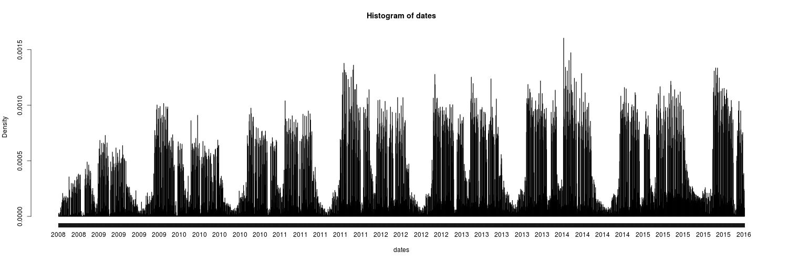
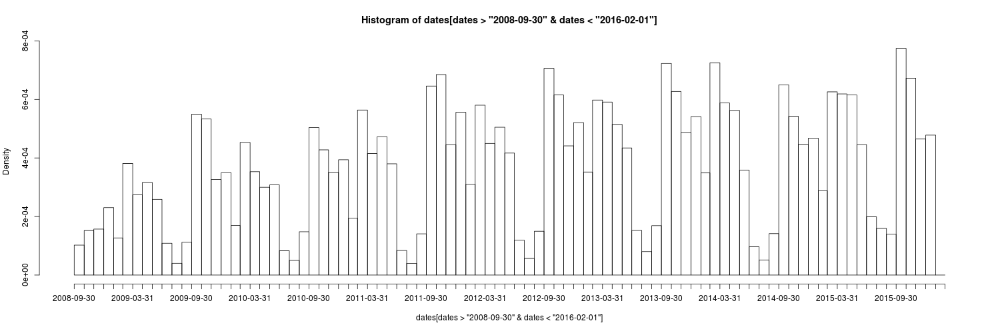
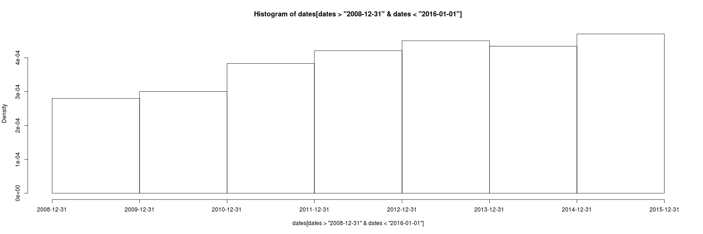
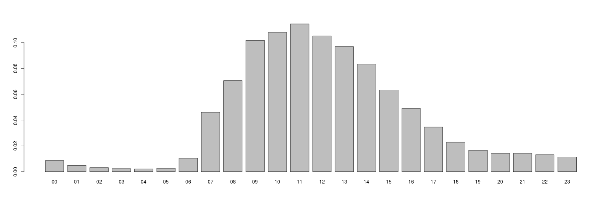
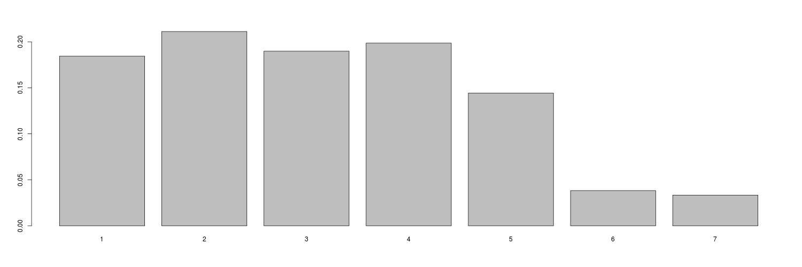

# RACHUNEK PRAWDOPODOBIEŃSTWA I STATYSTYKA - PROJEKT ZALICZENIOWY - RAPORT

**Data rozpoczęcia prac:	29.05.2016**
**Data oddania raportu: 13.06.2016**

### 1. Zespół

Nr grupy:	**4**

Nazwisko i imię prowadzącego grupę:	**Marek Śmieja**

Członkowie zespołu:

1. Skowroński	Daniel
2. Niemaszyk	Krzysztof

### 2.	Pozyskanie danych (2p)
*źródło danych, ogólna charakterystyka pliku/plików oraz informacje na temat tego, co zawiera zbiór danych i w jakim formacie został przekazany do analizy; jak pozyskano dane i czy wystąpiły jakieś problemy z ich pozyskaniem?*

Źródło danych - plik gzip. Zawiera on (bardzo) skompresowany plik z logami w niestandardowym formacie przy zachowaniu standardu: 1 wiersz - jeden rekord z informacjami o logowaniu do systemu wydziałowego. Plik pozyskano za pomocą programu wget. Wystąpił problem w postaci konieczności podania loginu i hasła w wierszu poleceń celem dostępu do intry.

### 3.	Opis danych (5p)
*opisać dane zawarte w źródle danych, ich strukturę i format, jakość, liczbę rekordów i pól w ramach rekordu, nazwy pól i ich znaczenie oraz inne "powierzchowne" cechy, które zostały wykryte; ocena, czy pozyskane dane spełniają wymagania dla projektu*

Plik z logami zawiera (zanonimizowane) dane o logowaniu do systemu wydziałowego. Każda linia pliku ma postać:

`Sep 23 20:33:41 (1 etypes {1}) ip00008: ISSUE: authtime 1222194821, etypes {rep=16 tkt=1 ses=1}, user00255`

gdzie (podane tylko dane istotne do analizy i tylko te proszę wykorzystywać w badaniach i raporcie):

- `Sep 23 20:33:41` - data logowania
- `ip00008` - zanonimizowany adres IP z którego następuje połączenie
- `(n etypes {x1, x2, ..., xn})` - wskazuje encoding types, które klient chciałby otrzymać (tzn. sposób podania hasła)
- `user00255` - zanonimizowane id użytkownika
- `authtime 1222194821` - unixowy timestamp, czyli liczba sekund od 1 stycznia 1970

Dane spełniają wymagania projektu jednak wymagają oczyszczenia celem łatwiejszego obrabiania w języku R.

### 4.	Czyszczenie danych (5p)
*sprawdzenie poprawności danych (kompletność rekordów, poprawność wartości), wykrycie wartości brakujących oraz wartości odstających, opisać sposób czyszczenia danych, radzenia sobie z informacjami brakującymi (czy rekordy z brakami są kasowane, czy też braki są wypełniane np. uśrednionymi wartościami cechy z innych rekordów) i odstającymi (czy są usuwane, czy zostają; dlaczego?)*

Poprawność danych weryfikowaliśmy tworząc wyrażenie regularne - dzięi temu zidentyfikowaliśmy właściwy format ID użytkownika - `(user|test)\d*` - bez tego analiza w R byłaby zaburzona.
Nie wykryliśmy również brakujących danych - nasz regexp, którym opisaliśmy jakich lini się spodziewamy miał tyle samo dopasowań, ile w pliku znajdowało się wszystkich linii.

Celem łatwiejszego importu i prostszej obróbki danych w R plik `log_phase8` przeparsowaliśmy skryptem w języku Perl (`skrypt1.pl`), który ciął każdy rekord na interesujace nas pola i zapisywał je do formatu CSV zawerającego kolumny: `date, etypes, ip, authtime, user`. Skrypt ponadto konwertował pierwszą datę z formatu tekstowego nie zawierającego roku na timestamp UNIXowy (taki sam jak `authtime`) rok pobierając z `authtime` (jednocześnie obsługując sytuację gdy mamy logowanie na granicy roku tj. rozpoczęte w roku x a zakończone w x+1) oraz strefę czasową. Tym samym rozmiar pliku wejściowego został znacząco zredukowany.

Następnie skonwertowaliśmy authtime na obiekt R'a `POSIXct`, a następnie wygenerowaliśmy wykresy które pozwoliły nam sprawdzić na jakim przedziale dat pracujemy.

Na tym poziomie nie usuwamy globalnie żanych danych - będziemy to robić podczas analizy konkretnych problemów, ponieważ dla różnych problemów mogą być różne progi wartości odstających. Np. jeśli chcemy analizować ilość logowań w danym miesiącu to miesiące niepełne (brzegowe - wrzesień 2008 i luty 2016) zostałyby odrzucone. Odrzucilibyśmy w ten sam sposób kilkanaście pełnych dni, które dla analizy według dni są jak najbardziej poprawne.

Zastosowaliśmy usuwanie wartości odstających dla wektora czasów między kolejnymi dostępami do systemu - ze wzgledu na charakterystykę takich danych, oraz wygląd wykresu wektora `differences`.

Dla statystyk ilości unikalnych adresów IP per użytkownik czyszczenie było bardziej skomplikowane - zastosowaliśmy połączenie metody półtora IQR z wartością stałą.

### 5.	Agregacja i transformacja danych (5p)
*opisać czy agregacja danych jest konieczna, a jeśli tak, to jak agregować dane i co dzięki temu osiągniemy; opisać inne niezbędne przekształcenia danych (np. stworzenie wartości liczby dni na podstawie dwóch pól z datą: "od" i "do", zamiana danych liczbowych na kategoryjne, wyliczanie wartości pochodnych, np. pole=wysokość\*szerokość itp.), wraz z uzasadnieniem konieczności ich przeprowadzenia; opisać wszelkie niezbędne syntaktyczne transformacje danych, tzn. ich przekształcanie bez zmiany ich znaczenia wraz z uzasadnieniem; przedstawić w czytelnej, graficznej postaci proces tej wstępnej obróbki danych opisanej w punktach 4-5.*

Agregacja potrzebna jest dla każdego problemu z osobna - np. celem analizy najpopularniejszych godzin logowania dokonujemy takowej wg. pola godziny z obiektu POSIXct. Do podstawowych analiz zagregowaliśmy czasy logowań według godzin, dni roku, dni tygodnia, miesięcy i lat, `etypes` oraz adresów IP i z takich danych stworzyliśmy wykresy.

Utowrzyliśmy również wektor czasów pomiędzy logowaniami do systemu, a także wektor ilość unikalnych adresów IP dla każdego z użytkowników.

\pagebreak

### 6.	Eksploracja danych (8p)
*statystyki opisowe (również w formie graficznej), histogramy, rozkłady wartości dla poszczególnych cech, zmiana wartości danych w czasie, korelacje pomiędzy atrybutami oraz próba wyjaśnienia ich pochodzenia, odkrywanie innego rodzaju zależności, np. trendów*

##### Ilości logowań zgrupowane po czasie

Na podstawie analizy powyższego wykresu można było odciąć wartości odstające z niepełnych okresów czas (miesięcy, lat).

\pagebreak

##### Analizy ogólne pozostałych parametrów

\pagebreak

##### Analiza ilości unikalnych adresów IP z jakich logowano się w danej jednostce czasu

\pagebreak

### 7.	Hipotezy badawcze (10p)
*na podstawie analiz z punktów 3-6 oraz zrozumienia dziedziny biznesowej problemu, jakiego zbiór danych dotyczy, opisać jakiego rodzaju problemy mogą być poddane badaniu i jakie hipotezy badawcze można postawić (np.: hipoteza o wartości parametru populacji, o określonym typie rozkładu danej cechy, o korelacji i innego rodzaju zależnościach itp.); w przypadku hipotez o rozkładach uzasadnić postawienie hipotezy zarówno podpierając się analizami z punktu 6, jak i ogólną teorią mówiącą, że danego typu zdarzenia powinny podlegać określonym rozkładom (np. czas między zgłoszeniami do systemu zwykle ma rozkład wykładniczy, liczba zdarzeń rzadkich w systemie - rozkład Poissona, wzrost w populacji ludzi - rozkład normalny itp.)*

##### Hipoteza (1)
Na podstawie wyglądu wykresu differences_trimmed, oraz faktu, że zawiera on czasy między kolejnymi zgłoszeniami do systemu, przyjmujemy hipotezę, że dane te mają rozkład wykładniczy (H0=rozkład `differences_trimmed` jest wykładniczy).

##### Hipoteza (2)
Badamy ilość adresów IP z jakich logował się każdy użytkownik. Ponieważ jest to zjawisko naturalne stawiamy hipotezę iż rozkład tych wartości jest normalny. Dane obcinamy metodą 1.5 IQR z góry celem odrzucenia użytkowników którym się chyba nudzi i studiują za długo, natomiast z dołu stałą=2 (ponieważ można przyjąć iż każdy student zalogował się przynajmniej raz z uczelni) - odrzuci to użytkowników którzy prawdopodobnie zalogowali sie tylko z uczelni. Użycie półtora IQR z dołu zaakceptowało wszystkie wartości (pierwszy kwantyl - 1.5*IQR < 0).

### 8.	Weryfikacja hipotez (10p)
*opisać zastosowane testy statystyczne (parametryczne oraz nieparametryczne), wraz z weryfikacją ich założeń oraz ich wyniki i interpretację tych wyników w odniesieniu do postawionych hipotez badawczych; uzasadnić zastosowanie określonych testów*

##### Hipoteza (1)
Dla danych zgromadzonych w wektorze differences_trimmed zastosowaliśmy test *Kolmogorov-Smirnov* - ze względu na charakterystykę danych test Chi kwadrat mógł nie dać wiarygodnych wyników-potwierdził to pakiet R zwracając informację: `In chisq.test(differences_trimmed/sum(differences_trimmed), p = tmp/sum(tmp)) : Chi-squared approximation may be incorrect`. Mimo danych i wykresu sugerujących rozkłąd wykładniczy, test statystyczny nie pozwolił przyjąć że hipoteza zerowa (H0=rozkład `differences_trimmed` jest wykładniczy) jest prawdziwa.

Poprawność wykonywania tego testu potwierdziliśmy na danych kontrolnych-odpowiednio wysokie p-value wskazuje, że losowo wygenerowany rozkład wykłądniczy zostaje potwierdzony przez tą samą procedurę.

Ponieważ poprzedni test nie potwierdził rozkładu wykładniczego danych postanowiliśmy również sprawdzić czy dane mają rozkład gamma. Również w tym przypadku niskie p-value nie pozwoliło przyjąć hipotezy zerowej (H0=dane mają rozkład gamma).

##### Hipoteza (2)
Po wykonaniu testu *Shapiro-Wilk'a* parametr W wyniósł **85%**. Dla porównania wzorcowy `shapiro.test(rnorm( seq(0,1,length=5000), mean=0, sd=1 ))` zwraca pewność rzędu 99%. Sensowny próg to **95%**.

Analiza wykresu gęstości ujawnia dość duży ogon wartości wysokich - zakładamy że są to użytkownicy korzystający z ISP który udziela dzierżaw DHCP o bardzo krótkim terminie ważności. Żeby oszacować udział tych użytkowników postanowiliśmy iterować się po ilości wartości odcinanych z góry tak by wykres gęstości (znormalizowany qqnorm) w kwantylach >25% był jak najbliższy idealnemu (qqline). Szacunkowa ilość to 1000 - około 21%.

### 9.	Wnioski (5p)
*wykorzystując obserwacje i analizy z poprzednich punktów opisać wnioski z badań, ale językiem biznesowym, czyli językiem dziedziny, której dotyczą dane (np. dane logów z serwera mogą dotyczyć zachowań użytkowników tego serwera; dane ze sklepu - zachowań klientów itd.)*

...

### 10.	Uwagi
*wszelkie inne wykonane aktywności niewymienione w poprzednich punktach*
